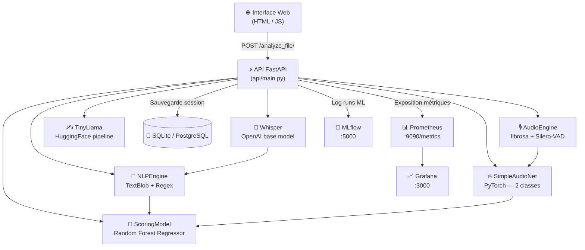

# PRO8605 — Plateforme d'Analyse Soft Skills & Simulateur d'Entretien

> Projet de Fin d'Études — Application B2B d'analyse comportementale audio/texte en temps réel, avec scoring IA, monitoring MLOps et pipeline complet de Machine Learning.

---

## Table des matières

1. [Vue d'ensemble](#1-vue-densemble)
2. [Architecture](#2-architecture)
3. [Pipeline d'analyse temps réel](#3-pipeline-danalyse-temps-réel)
4. [Modèles — Fonctionnement & Entraînement](#4-modèles--fonctionnement--entraînement)
   - 4.1 [AudioEngine — Extraction de features](#41-audioengine--extraction-de-features)
   - 4.2 [Modèle DL — SimpleAudioNet (PyTorch)](#42-modèle-dl--simpleaudionet-pytorch)
   - 4.3 [Transcription — Whisper (OpenAI)](#43-transcription--whisper-openai)
   - 4.4 [NLPEngine — Analyse de texte](#44-nlpengine--analyse-de-texte)
   - 4.5 [Modèle ML — Random Forest Regressor](#45-modèle-ml--random-forest-regressor)
   - 4.6 [Calcul des Soft Skills](#46-calcul-des-soft-skills)
   - 4.7 [Rapport LLM — TinyLlama](#47-rapport-llm--tinyllama)
5. [Métriques évaluées](#5-métriques-évaluées)
6. [MLOps — Tracking & Monitoring](#6-mlops--tracking--monitoring)
   - 6.1 [MLflow — Tracking des expériences](#61-mlflow--tracking-des-expériences)
   - 6.2 [Prometheus — Métriques temps réel](#62-prometheus--métriques-temps-réel)
   - 6.3 [Grafana — Visualisation](#63-grafana--visualisation)
7. [Données d'entraînement](#7-données-dentraînement)
8. [Installation & Lancement](#8-installation--lancement)
9. [Tests unitaires & CI/CD](#9-tests-unitaires--cicd)
10. [Structure du projet](#10-structure-du-projet)
11. [Limites & Roadmap](#11-limites--roadmap)

---

## 1. Vue d'ensemble

PRO8605 est une plateforme web full-stack permettant à un candidat (ou formateur RH) d'enregistrer une prise de parole depuis le navigateur et d'obtenir en retour une **analyse automatique complète** de ses soft skills :

| Dimension | Ce qui est mesuré |
|---|---|
| **Voix physique** | Volume RMS, débit (BPM), ratio de silences |
| **Émotion** | Classification binaire Calme / Stressé (PyTorch) |
| **Discours** | Transcription automatique (Whisper), sentiments (TextBlob), tics de langage |
| **Score global** | Note /100 calculée par Random Forest + pénalités |
| **Soft skills** | Stress estimé, confiance, dynamisme (formules composites) |
| **Rapport détaillé** | Texte généré par LLM (TinyLlama) |

---

## 2. Architecture



### Services Docker

| Service | Port | Rôle |
|---|---|---|
| `api` | 8000 | Backend FastAPI + Frontend statique |
| `mlflow` | 5000 | Tracking des expériences ML |
| `postgres` | 5432 | Base de données sessions (optionnel) |
| `prometheus` | 9090 | Collecte des métriques temps réel |
| `grafana` | 3000 | Dashboard de visualisation |

---

## 3. Pipeline d'analyse temps réel

Lorsqu'un utilisateur clique sur **"Démarrer l'analyse"**, voici ce qui se passe dans `POST /analyze_file/` :

```
① Réception du fichier audio (WAV via MediaRecorder)
        ↓
② AudioEngine.process_signal()
   → librosa : RMS volume, tempo (beat_track), ZCR, spectral_centroid
   → Silero-VAD : détection des segments de parole → pause_ratio
   → dl_input_vector = [rms, zcr, spec_centroid/1000, tempo/200, pause_ratio]
        ↓
③ InterviewModel.transcribe_audio()     [Whisper]
   → librosa.load à 16 kHz
   → whisper.transcribe(language="fr", initial_prompt=...)
   → preclean() : normalisation du texte
        ↓
④ InterviewModel.predict_emotion()      [SimpleAudioNet]
   → Inférence PyTorch sur dl_input_vector
   → Softmax → classe 0 (Calme) ou 1 (Stressé) + confidence
        ↓
⑤ NLPEngine.analyze_text()              [TextBlob + Regex]
   → TextBlob : sentiment polarity [-1, 1]
   → Regex \b mot \b : détection des tics de langage
        ↓
⑥ ScoringModel.predict_score()          [Random Forest]
   → Fusion : volume, tempo, pause_ratio, sentiment, filler_count, stress_level
   → Score brut ∈ [0, 100]
        ↓
⑦ Calcul du score final avec pénalités
   → -10 pts par tic de langage détecté
   → -15 pts si sentiment < -0.1
   → score_final = clamp(score_brut - pénalités, 0, 100)
        ↓
⑧ compute_soft_skills()                 [Formules analytiques]
   → stress, confidence, dynamism
        ↓
⑨ Génération rapport LLM               [TinyLlama-1.1B]
   → Prompt structuré avec toutes les métriques
   → Génération texte max 512 tokens
        ↓
⑩ Réponse JSON → affichage UI
```

---

## 4. Modèles — Fonctionnement & Entraînement

### 4.1 AudioEngine — Extraction de features

**Fichier :** `src/processors/audio_engine.py`

L'AudioEngine transforme un fichier audio brut en vecteur numérique utilisable par les modèles.

| Feature | Bibliothèque | Description |
|---|---|---|
| `volume` (RMS) | librosa | Énergie moyenne du signal — indicateur d'assurance vocale |
| `tempo` (BPM) | librosa.beat_track | Fréquence des battements — indicateur de débit |
| `zcr` | librosa | Zero Crossing Rate — rugosité/nervosité de la voix |
| `spectral_centroid` | librosa | Centre de gravité fréquentiel — "brillance" de la voix |
| `pause_ratio` | Silero-VAD | `1 - (durée_parole / durée_totale)` — gestion des silences |

Le **vecteur DL** transmis au réseau de neurones est :
```python
dl_input_vector = [rms, zcr, spectral_centroid/1000, tempo/200, pause_ratio]
```
La normalisation par 1000 et 200 ramène chaque dimension à un ordre de grandeur similaire (~[0,1]).

---

### 4.2 Modèle DL — SimpleAudioNet (PyTorch)

**Fichier :** `src/models/dl_model.py`

#### Architecture

```
Input (5) → Linear(5→64) → ReLU → Dropout(0.2)
          → Linear(64→32) → ReLU
          → Linear(32→2)  → Softmax
          → Classe : 0 = Calme, 1 = Stressé
```

C'est un **classificateur binaire** léger, entraînable sur CPU en quelques secondes.

#### Entraînement (`InterviewModel.train_custom_model`)

```python
# Lancer l'entraînement
from src.models.dl_model import InterviewModel
from src.data_pipeline import DataPipeline

pipeline = DataPipeline('storage/fake_sessions.csv')
df = pipeline.extract()
df = pipeline.transform(df)
model = InterviewModel()
results = model.train_custom_model(df, epochs=50, batch_size=16)
```

| Hyperparamètre | Valeur |
|---|---|
| Epochs | 50 |
| Batch size | 16 |
| Optimizer | Adam |
| Loss | CrossEntropyLoss |
| Dropout | 0.2 |

#### Métriques loggées (MLflow)

| Métrique | Description |
|---|---|
| `final_loss` | Valeur de la loss sur la dernière epoch |
| `accuracy` | Accuracy sur le jeu de test |
| `f1_score` | F1-score pondéré (sklearn) |

Le modèle entraîné est sauvegardé dans `storage/models/emotion_net.pth`.

---

### 4.3 Transcription — Whisper (OpenAI)

**Fichier :** `src/models/dl_model.py` — méthode `transcribe_audio()`

Whisper `base` (74M paramètres) est utilisé pour la transcription en français. Un **prompt d'amorçage** force le modèle à ne pas censurer les hésitations :

```python
tic_prompt = "C'est un entretien d'embauche. Le candidat hésite souvent, il dit euh, bah, voilà, du coup."
```

Le texte transcrit passe ensuite par `preclean()` : mise en minuscules, normalisation des espaces autour de la ponctuation, séparation chiffres/lettres.

**Métrique Prometheus loggée :** `dl_transcription_time_seconds`

---

### 4.4 NLPEngine — Analyse de texte

**Fichier :** `src/processors/nlp_engine.py`

| Analyse | Méthode | Output |
|---|---|---|
| Sentiment | TextBlob `.sentiment.polarity` | Score ∈ [-1, 1] |
| Tics de langage | Regex `\b mot \b` | Dict `{mot: count}` |
| Comptage mots | `text.split()` | `word_count` |

La liste des mots à détecter est chargée depuis `config/settings.yaml` (clé `fillers`) :
```yaml
fillers:
  - euh
  - bah
  - genre
  - du coup
  - ben
  - en fait
  - voilà
```

**Métriques Prometheus loggées :** `nlp_filler_words_total` (counter), `nlp_sentiment_score` (gauge)

---

### 4.5 Modèle ML — Random Forest Regressor

**Fichier :** `src/models/ml_model.py`

C'est le modèle de **scoring principal**. Il prédit une note /100 en fusionnant toutes les sources de données.

#### Vecteur de features (fusion audio + NLP + émotion)

```python
features = ['volume', 'tempo', 'pause_ratio', 'sentiment', 'filler_count', 'stress_level']
# stress_level : 1.0 si Stressé, 0.0 si Calme
```

#### Hyperparamètres

| Paramètre | Valeur |
|---|---|
| `n_estimators` | 100 arbres |
| `max_depth` | 10 |
| `test_size` | 20% |
| `random_state` | 42 |

#### Entraînement (`ScoringModel.train`)

```python
from src.models.ml_model import ScoringModel
from src.data_pipeline import DataPipeline

pipeline = DataPipeline('storage/fake_sessions.csv')
df = pipeline.extract()
model = ScoringModel()
results = model.train(df)
# {'mae': 8.42, 'r2': 0.78}
```

#### Métriques loggées (MLflow — expérience `Final_Scoring_ML`)

| Métrique | Description |
|---|---|
| `mae` | Mean Absolute Error — erreur moyenne en points |
| `r2` | Coefficient de détermination — qualité globale du modèle |
| `n_estimators` | Paramètre loggé comme param MLflow |
| `max_depth` | Paramètre loggé comme param MLflow |

Le modèle entraîné est sauvegardé dans `storage/models/scoring_rf.joblib`.

---

### 4.6 Calcul des Soft Skills

**Fichier :** `src/evaluation/metrics.py`

Trois scores composites sont calculés **analytiquement** (sans modèle supplémentaire) à partir des features audio et NLP :

```python
def compute_soft_skills(audio_metrics, nlp_metrics):
    pause_ratio = audio_metrics.get('pause_ratio', 0)
    sentiment   = nlp_metrics.get('sentiment_score', 0)
    tempo       = audio_metrics.get('tempo', 0)

    stress     = clamp(1 - sentiment - 0.5 * (1 - pause_ratio))
    confidence = clamp(sentiment + 0.5 * (1 - pause_ratio))
    dynamism   = clamp(tempo / 120)
```

| Score | Interprétation | Plage |
|---|---|---|
| `stress` | Élevé = beaucoup de pauses + sentiment négatif | [0, 1] |
| `confidence` | Élevé = sentiment positif + peu de pauses | [0, 1] |
| `dynamism` | Élevé = débit rapide (référence 120 BPM) | [0, 1] |

Ces scores sont exposés dans la réponse API sous `details.soft_skills` et affichés dans l'UI.

---

### 4.7 Rapport LLM — TinyLlama

**Modèle :** `TinyLlama/TinyLlama-1.1B-Chat-v1.0` (HuggingFace)

Un rapport textuel est généré automatiquement après chaque analyse via le pipeline HuggingFace `text-generation`. Le prompt est structuré selon le format `<|system|> / <|user|> / <|assistant|>` de TinyLlama et injecte toutes les métriques calculées.

Le rapport couvre :
1. Résumé global
2. Analyse des scores
3. Analyse de la transcription
4. Feedback personnalisé (points forts / axes d'amélioration)
5. Conseils pratiques

> TinyLlama fonctionne sur CPU mais est lent (~30-60s). Pour accélérer, passer à un GPU ou utiliser une API distante.

---

## 5. Métriques évaluées

### Métriques de performance des modèles

| Modèle | Métrique | Valeur typique | Plateforme |
|---|---|---|---|
| SimpleAudioNet | Accuracy | ~70-80% | MLflow |
| SimpleAudioNet | F1-score (pondéré) | ~0.70-0.78 | MLflow |
| SimpleAudioNet | Loss finale | ~0.4-0.6 | MLflow |
| Random Forest | MAE (points) | ~6-10 pts | MLflow |
| Random Forest | R² | ~0.70-0.85 | MLflow |

> Ces valeurs sont obtenues sur `storage/fake_sessions.csv` (données synthétiques, 2000 sessions, 12% de bruit de labels). Sur données réelles, les performances peuvent varier.

### Métriques temps réel (par analyse)

| Métrique Prometheus | Type | Description |
|---|---|---|
| `api_processing_time_seconds` | Histogram | Durée de traitement par module (`audio`, `nlp`) |
| `dl_transcription_time_seconds` | Histogram | Durée de transcription Whisper |
| `model_inference_time_seconds` | Histogram | Durée d'inférence par modèle |
| `model_prediction_confidence` | Histogram | Confiance de la prédiction émotion |
| `nlp_filler_words_total` | Counter | Nombre cumulé de tics détectés |
| `nlp_sentiment_score` | Gauge | Score de sentiment de la dernière analyse |
| `audio_stress_level` | Gauge | Niveau de stress audio (0 ou 1) |
| `audio_features` | Gauge | Volume, BPM, pause_ratio (labeled) |
| `interview_final_score` | Gauge | Score final de la dernière analyse |
| `api_requests_total` | Counter | Nombre de requêtes par endpoint/status |

---

## 6. MLOps — Tracking & Monitoring

### 6.1 MLflow — Tracking des expériences

**URL :** `http://localhost:5000`

MLflow est utilisé pour logger automatiquement chaque entraînement de modèle :

```
┌─────────────────────────────────────────────────┐
│  MLflow UI — http://localhost:5000              │
│                                                  │
│  Experiments:                                    │
│  ├── Audionet_DL (DL — émotion)                 │
│  │   ├── Run #1 : epochs=50, accuracy=0.74 ...  │
│  │   └── Run #2 : epochs=100, f1=0.78 ...       │
│  └── Final_Scoring_ML (ML — scoring)            │
│      ├── Run #1 : n_estim=100, MAE=8.4, R2=0.78 │
│      └── Run #2 : n_estim=200, MAE=7.1, R2=0.82 │
└─────────────────────────────────────────────────┘
```

**Ce qu'on peut faire dans l'UI MLflow :**
- Comparer les runs entre eux (graphes de métriques)
- Visualiser les hyperparamètres et leurs effets
- Télécharger les artefacts (modèles `.pth`, `.joblib`)
- Reproductibilité : chaque run est daté et tracé

**Backend de stockage :** SQLite (`storage/mlflow/mlflow.db`) + artefacts dans `storage/mlflow/artifacts/`

---

### 6.2 Prometheus — Métriques temps réel

**URL :** `http://localhost:9090`

Prometheus scrape l'endpoint `/metrics` de l'API FastAPI toutes les **10 secondes**.

Pour interroger manuellement :
```promql
# Durée moyenne de traitement audio
rate(api_processing_time_seconds_sum[1m]) / rate(api_processing_time_seconds_count[1m])

# Score final des 10 dernières analyses
interview_final_score

# Taux de tics de langage
rate(nlp_filler_words_total[5m])
```

---

### 6.3 Grafana — Visualisation

**URL :** `http://localhost:3000`  
**Login par défaut :** anonyme (viewer, configuré dans `infra/grafana/grafana.ini`)

Le dashboard **"PRO8605 Dashboard"** est provisionné automatiquement au démarrage depuis `infra/grafana/dashboards_json/dashboard.json`.

**Panels disponibles :**

| Panel | Requête Prometheus | Type |
|---|---|---|
| Durée de traitement par module | `rate(api_processing_time_seconds_sum[1m]) / count[1m]` | Timeseries |
| Score de sentiment NLP | `nlp_sentiment_score` | Timeseries |
| Score final d'entretien | `interview_final_score` | Timeseries |
| Tics de langage (taux) | `rate(nlp_filler_words_total[1m])` | Timeseries |
| Stress détecté | `audio_stress_level` | Stat |
| Temps d'inférence par modèle | `rate(model_inference_time_seconds_sum[1m])` | Timeseries |

**Pour ajouter un panel manuellement :** Dashboard → Add panel → Datasource: Prometheus → saisir la requête PromQL.

---

## 7. Données d'entraînement

**Fichier :** `storage/fake_sessions.csv`  
**Généré par :** `scripts/simulate_data.py`

Le dataset comprend **2 000 sessions synthétiques** avec les distributions suivantes :

| Feature | Candidat Calme | Candidat Stressé |
|---|---|---|
| Volume | N(0.07, 0.04) | N(0.05, 0.03) |
| Tempo (BPM) | N(110, 20) | N(130, 25) |
| Pause ratio | N(0.18, 0.10) | N(0.35, 0.15) |

**Fonction de scoring synthétique :**
```python
target_score = 85 - pause_ratio*60 - filler_count*3 + sentiment*10 - label*5 + bruit(±12)
```

**Bruit de labels :** 12% des labels sont inversés aléatoirement pour simuler la réalité.

Pour régénérer les données :
```bash
python scripts/simulate_data.py --mode metrics
```

---

## 8. Installation & Lancement

### Prérequis
- Docker & Docker Compose
- (Optionnel) Python 3.10+ + venv pour le développement local

### Démarrage rapide (Docker)

```bash
# 1. Copier le fichier d'environnement
cp .env.example .env

# 2. Construire et démarrer tous les services
docker-compose up --build -d

# 3. Accès aux services
# → API + UI :   http://localhost:8000
# → MLflow :     http://localhost:5000
# → Prometheus : http://localhost:9090
# → Grafana :    http://localhost:3000
```

### Développement local (sans Docker)

```bash
# 1. Créer et activer l'environnement virtuel
python -m venv venv
venv\Scripts\activate       # Windows
source venv/bin/activate    # Linux/macOS

# 2. Installer les dépendances
pip install -r requirements.txt

# 3. Lancer l'API
uvicorn api.main:app --host 0.0.0.0 --port 8000 --reload
```

### Initialisation PostgreSQL (optionnel)

```bash
# Démarrer le conteneur PostgreSQL
docker-compose up -d postgres

# Créer la table sessions
python scripts/init_postgres.py

# Utiliser PostgreSQL dans le code
from database.db_manager import DBManager
import yaml
with open('config/settings.yaml') as f:
    cfg = yaml.safe_load(f)
db = DBManager(use_postgres=True, pg_config=cfg['postgres'])
```

### Commandes Makefile

```bash
make build     # docker-compose build
make up        # docker-compose up -d
make down      # docker-compose down
make logs      # docker-compose logs -f
make test-nlp  # test NLP sans audio
make simulate  # génèrer les données synthétiques
make clean     # supprimer les __pycache__
```

---

## 9. Tests unitaires & CI/CD

### Tests unitaires

```bash
# Lancer tous les tests
python -m unittest discover -s tests/unit

# Lancer un test spécifique
python -m unittest tests.unit.test_ml_model
```

| Fichier | Ce qui est testé |
|---|---|
| `tests/unit/test_data_pipeline.py` | `DataPipeline.transform()` (pas de NaN), `split()` (tailles correctes) |
| `tests/unit/test_dl_model.py` | `SimpleAudioNet` (shape de sortie), `predict_emotion()` (labels valides, confidence ∈ [0,1]) |
| `tests/unit/test_ml_model.py` | Score par défaut (50.0), entraînement (MAE/R2 retournés), prédiction dans [0,100], stressé < calme |

### CI/CD — GitHub Actions

**Workflow :** `.github/workflows/ci-cd.yml`

Déclenché sur chaque push/PR vers `main` :

```
1. Setup Python 3.10
2. pip install -r requirements.txt
3. python -m unittest discover -s tests/unit
4. flake8 . (linting)
5. Deploy (placeholder — à implémenter)
```

---

## 10. Structure du projet

```
pro8605/
├── .env.example              # Variables d'environnement (template)
├── .github/workflows/
│   └── ci-cd.yml             # Pipeline CI/CD GitHub Actions
├── api/
│   ├── Dockerfile
│   ├── main.py               # FastAPI — routes, pipeline d'inférence
│   └── static/
│       ├── index.html        # UI — design dark/gold, recorder widget
│       ├── script.js         # MediaRecorder, fetch API, affichage résultats
│       └── style.css
├── config/
│   └── settings.yaml         # Seuils audio, liste des fillers
├── database/
│   └── db_manager.py         # SQLite (défaut) / PostgreSQL (optionnel)
├── docker-compose.yml        # Orchestration 5 services
├── infra/
│   ├── grafana/
│   │   ├── dashboards_json/dashboard.json   # 6 panels Grafana
│   │   ├── grafana.ini
│   │   └── provisioning/     # Datasource + dashboard auto-provisionnés
│   └── prometheus/
│       └── prometheus.yaml   # Scrape l'API toutes les 10s
├── Makefile
├── requirements.txt
├── scripts/
│   ├── simulate_data.py      # Génération de 2000 sessions synthétiques
│   ├── init_postgres.py      # Init table PostgreSQL
│   └── test_nlp_bypass.py    # Test NLP + ML sans audio
├── src/
│   ├── data_pipeline.py      # Extract / Transform / Split
│   ├── evaluation/
│   │   └── metrics.py        # compute_soft_skills()
│   ├── models/
│   │   ├── dl_model.py       # InterviewModel : Whisper + SimpleAudioNet
│   │   └── ml_model.py       # ScoringModel : Random Forest
│   ├── monitoring/
│   │   ├── metrics.py        # 10 métriques Prometheus
│   │   └── mlflow/
│   │       ├── setup.py      # URI tracking dynamique
│   │       └── utils.py      # log_experiment()
│   └── processors/
│       ├── audio_engine.py   # librosa + Silero-VAD
│       └── nlp_engine.py     # TextBlob + Regex
├── storage/
│   ├── fake_sessions.csv     # 2000 sessions synthétiques
│   ├── storage_manager.py
│   └── models/
│       ├── emotion_net.pth   # Poids SimpleAudioNet (après entraînement)
│       └── scoring_rf.joblib # Modèle Random Forest (après entraînement)
└── tests/
    └── unit/
        ├── test_data_pipeline.py
        ├── test_dl_model.py
        └── test_ml_model.py
```

---

## 11. Limites & Roadmap

### Limites actuelles

| Aspect | Limite |
|---|---|
| **Données** | Dataset synthétique (2000 sessions, distributions gaussiennes) — biais possible |
| **Modèles** | SimpleAudioNet très léger — précision limitée sur données réelles |
| **Whisper** | Lent sur CPU (~10-30s pour 1 min d'audio) |
| **TinyLlama** | LLM 1.1B — qualité de rapport limitée, lent sur CPU |
| **Auth** | Aucune authentification — usage académique uniquement |
| **Stockage** | SQLite par défaut — non adapté à la production multi-utilisateurs |
| **Audio long** | Audios > 3 min non optimisés |

### Roadmap

- [ ] Migration PostgreSQL activée par défaut via variable d'environnement
- [ ] Authentification JWT (FastAPI Security)
- [ ] Support audio long (chunking + streaming)
- [ ] Améliorer SimpleAudioNet avec des données audio réelles
- [ ] Remplacer TinyLlama par une API LLM externe (OpenAI, Mistral)
- [ ] Compléter le step de déploiement dans GitHub Actions
- [ ] Dashboard Grafana : alertes automatiques sur seuils


## Fonctionnalités principales
- **Simulation d'entretien** : Enregistrement audio via le navigateur, analyse en temps réel.
- **Analyse IA** : Extraction de métriques audio (stress, dynamisme, pauses) et NLP (sentiment, fillers, transcription).
- **Feedback Soft Skills** : Calcul automatique de stress, confiance, dynamisme.
- **Dashboard** : Visualisation des historiques, courbes, logs, et performances modèles.
- **API REST** : Exposition des modèles et analyses via FastAPI.
- **MLOps** : Intégration MLflow (tracking), Prometheus (metrics), Grafana (dashboard).
- **Tests unitaires** : Pour pipeline, modèles ML/DL, etc.


# Projet PFE PRO 8605

Ce projet est une plateforme complète d’analyse d’entretiens, d’audio et de texte, avec scoring automatique, monitoring, et visualisation. Il s’adresse aux besoins de simulation, d’évaluation, et de feedback pour des applications RH, pédagogiques ou de recherche.

---

## Migration vers PostgreSQL (préparation)

Le projet utilise actuellement SQLite pour la sauvegarde des sessions. Pour une utilisation en production ou multi-utilisateur, il est recommandé de migrer vers PostgreSQL.

**Étapes prévues :**
- Adapter le fichier `database/db_manager.py` pour supporter PostgreSQL (utilisation de SQLAlchemy ou psycopg2).
- Ajouter la configuration PostgreSQL dans `config/settings.yaml` et dans `docker-compose.yml`.
- Mettre à jour la documentation d’installation.

> La migration n’est pas encore effective mais la structure du code est pensée pour faciliter cette évolution.

### Utilisation PostgreSQL

1. Lancer le service PostgreSQL avec Docker Compose :
  ```bash
  docker-compose up -d postgres
  ```
2. Initialiser la table sessions :
  ```bash
  python scripts/init_postgres.py
  ```
3. Modifier la configuration pour utiliser PostgreSQL dans le code :
  ```python
  from database.db_manager import DBManager
  import yaml
  with open('config/settings.yaml', 'r') as f:
     cfg = yaml.safe_load(f)
  db = DBManager(use_postgres=True, pg_config=cfg['postgres'])
  ```
4. Tester la sauvegarde et la récupération des sessions.

> Pour revenir à SQLite, il suffit de passer `use_postgres=False`.

## Captures d'écran

> Ajoutez ici des captures d’écran de l’interface web, du dashboard Grafana, de MLflow, etc.

| Interface Web | Dashboard Grafana | MLflow UI |
|:-------------:|:----------------:|:---------:|
|  |  |  |

## Démo vidéo & Valorisation

- [Lien vers la vidéo de démonstration](#) <!-- À compléter après enregistrement -->
- [Post LinkedIn valorisant le projet](#) <!-- À compléter après publication -->

## Perspectives & Roadmap

### Ce qu’il reste à faire :

- **Données** : Récupérer un jeu de données audio plus complet et traiter des audios plus longs.
- **Stockage** : Migrer la base de données vers PostgreSQL pour une meilleure scalabilité.
- **Dashboards** : Finaliser la configuration de Prometheus et Grafana, enrichir les dashboards.
- **CI/CD** : Corriger et implémenter l’automatisation complète des tests et du déploiement.
- **Interface** : Améliorer l’interface web (ergonomie, feedback utilisateur, responsive, accessibilité).
- **Produit** : Intégrer un LLM pour fournir un rapport texte complet après chaque analyse.
- **Sécurité** : Ajouter une authentification et une gestion des accès.
- **Documentation** : Ajouter des exemples d’utilisation, des tutoriels, et enrichir la FAQ.

### Bonus valorisation
- Réaliser un post LinkedIn valorisant le projet, avec une courte vidéo de démonstration (lien à ajouter ci-dessous).

## Limites et analyse critique

- **Qualité des données** : Le jeu de données utilisé est simulé et limité en diversité. Les résultats peuvent être biaisés et ne pas généraliser à des cas réels variés.
- **Biais des modèles** : Les modèles ML/DL sont entraînés sur des données synthétiques, ce qui peut introduire des biais et limiter la robustesse.
- **Temps d'inférence** : L'analyse audio et la transcription peuvent prendre plusieurs secondes selon la longueur de l'audio et la charge serveur.
- **Gestion des longs audios** : Le traitement d'audios longs (>3 min) n'est pas encore optimisé.
- **Stockage** : Utilisation actuelle de SQLite, non adaptée à la montée en charge ou à un usage multi-utilisateur. Migration PostgreSQL prévue.
- **Dashboards** : Les dashboards Grafana sont en cours de configuration et peuvent être enrichis.
- **CI/CD** : L'automatisation des tests unitaires est en place (GitHub Actions), mais le déploiement continu reste à implémenter.
- **Interface web** : L'UI est fonctionnelle mais perfectible (ergonomie, accessibilité, responsive design).
- **LLM** : L'intégration d'un LLM pour la génération de rapports texte détaillés est en perspective.
- **Sécurité** : Les aspects sécurité (authentification, gestion des accès) ne sont pas encore traités.

## Schéma d'architecture

```mermaid
flowchart TD
  A[Interface Web (HTML/JS)] -->|Upload audio| B(API FastAPI)
  B -->|Extraction features| C(AudioEngine)
  B -->|Transcription| D(Whisper)
  B -->|Analyse NLP| E(NLPEngine)
  B -->|Prédiction émotion| F(DL Model)
  B -->|Scoring global| G(ML Model)
  B -->|Sauvegarde| H[(Base SQLite)]
  B -->|Export métriques| I(Prometheus)
  I --> J[Grafana]
  B -->|Tracking runs| K(MLflow)
  K --> L[UI MLflow]
  J --> M[Dashboard Grafana]
```


## Fonctionnalités

- **Simulation d’entretien** : Enregistrement audio, analyse en temps réel.
- **Extraction de métriques** : Audio (volume, tempo, pauses, stress), NLP (sentiment, fillers, transcription).
- **Scoring automatique** : Modèles ML/DL pour score global, émotion, soft skills.
- **Historique & base de données** : Sauvegarde des sessions, accès aux résultats.
- **API REST** : Exposition des analyses, endpoints d’entraînement, healthcheck.
- **Monitoring MLOps** : MLflow (tracking runs, modèles, artefacts), Prometheus (metrics), Grafana (dashboards).
- **Tests unitaires** : Validation pipeline, modèles, intégration.
- **Personnalisation** : Paramètres via YAML, ajout de modèles, dashboards.

---

## Architecture du projet

```
pro8605/
├── .dockerignore
├── .env
├── .git/
├── .github/
├── .gitignore
├── api/
│   ├── Dockerfile
│   ├── __init__.py
│   ├── main.py
│   ├── static/
│   │   ├── index.html
│   │   ├── script.js
│   │   └── style.css
│   └── __pycache__/
├── config/
│   └── settings.yaml
├── database/
│   └── db_manager.py
├── docker-compose.yml
├── infra/
│   ├── grafana/
│   │   ├── dashboards_json/
│   │   │   └── dashboard.json
│   │   ├── grafana.ini
│   │   └── provisioning/
│   │       ├── dashboards/
│   │       │   └── dashboard.yml
│   │       └── datasources/
│   │           └── datasource.yml
│   └── prometheus/
│       └── prometheus.yaml
├── Makefile
├── README.md
├── requirements.txt
├── scripts/
│   ├── simulate_data.py
│   └── test_nlp_bypass.py
├── src/
│   ├── data_pipeline.py
│   ├── evaluation/
│   │   └── metrics.py
│   ├── models/
│   │   ├── dl_model.py
│   │   ├── ml_model.py
│   │   └── __pycache__/
│   ├── monitoring/
│   │   ├── metrics.py
│   │   ├── mlflow/
│   │   │   ├── setup.py
│   │   │   └── utils.py
│   │   └── __pycache__/
│   └── processors/
│       ├── audio_engine.py
│       ├── nlp_engine.py
│       └── __pycache__/
├── storage/
│   ├── fake_sessions.csv
│   ├── storage_manager.py
│   ├── mlflow/
│   │   ├── artifacts/
│   │   └── mlflow.db
│   └── models/
├── tests/
│   └── unit/
│       ├── test_data_pipeline.py
│       ├── test_dl_model.py
│       └── test_ml_model.py
├── venv/
```

---

## Pipeline d’analyse

1. **Upload audio** (API ou frontend)
2. **AudioEngine** : Extraction des features audio
3. **DL Model** : Transcription (Whisper), prédiction émotion/stress (PyTorch)
4. **NLP Engine** : Analyse du texte (sentiment, fillers)
5. **ML Model** : Scoring global (LogisticRegression/RandomForest)
6. **Sauvegarde session** : Enregistrement des résultats en base SQLite (via `DBManager`)
7. **Monitoring** : Export des métriques Prometheus, tracking MLflow
8. **Visualisation** : Dashboards Grafana, historique sessions

---

## Modules principaux

- **api/** : Backend FastAPI, endpoints d’analyse, entraînement, monitoring, frontend statique
- **src/** : Logique métier (modèles ML/DL, pipeline, NLP/audio processors, monitoring)
- **database/** : Gestion base SQLite, sauvegarde et récupération des sessions
- **infra/** : Config Grafana/Prometheus
- **storage/** : Données simulées, modèles sauvegardés, artefacts MLflow
- **config/** : Paramètres YAML (seuils, fillers, etc)
- **scripts/** : Génération de données fictives, tests NLP
- **tests/** : Tests unitaires pipeline, modèles

---

## Entraînement & Évaluation

- **ML Model** :
  - Modèle de scoring (LogisticRegression/RandomForest)
  - Méthodes : train, predict, evaluate, save, load
  - Entraînement via endpoint ou script, données simulées (`fake_sessions.csv`)
- **DL Model** :
  - Réseau PyTorch pour émotion/stress
  - Transcription audio via Whisper
  - Méthodes d’entraînement, sauvegarde
- **NLP Engine** :
  - Analyse sentiment, fillers, transcription
- **DBManager** :
  - Sauvegarde des sessions, récupération historique

---

## Monitoring & MLOps

- **MLflow** : Tracking runs, modèles, artefacts (UI : http://localhost:5000)
- **Prometheus** : Scraping métriques exposées par l’API (http://localhost:9090)
- **Grafana** : Dashboards pour visualiser métriques, historiques, performances modèles (http://localhost:3000)
- **Logs** : Logging standard Python, logs en temps réel (API, scripts, modèles)

---

## Tests

Lancer tous les tests unitaires :
```bash
python -m unittest discover -s tests/unit
```

---

## Utilisation rapide

1. **Build & lancement des services**
   ```bash
   docker-compose up --build
   ```
2. **Accéder à l’API** : http://localhost:8000/docs
3. **Accéder à MLflow** : http://localhost:5000
4. **Accéder à Grafana** : http://localhost:3000
5. **Accéder à Prometheus** : http://localhost:9090

---

## Personnalisation & extension

- **Configuration** : Modifiez `config/settings.yaml` pour ajuster les seuils audio/NLP, la liste des fillers, etc.
- **Ajout de modèles** : Placez vos modèles ML/DL dans `src/models/` et adaptez les endpoints FastAPI si besoin.
- **Dashboards Grafana** : Ajoutez ou modifiez les panels dans `infra/grafana/dashboards_json/dashboard.json` et la configuration dans `infra/grafana/provisioning/`.
- **Base de données** : Modifiez `database/db_manager.py` pour changer de backend (ex : PostgreSQL).
- **Pipeline** : Ajoutez de nouveaux extracteurs de features ou étapes de traitement dans `src/processors/`.
- **Tests** : Ajoutez vos propres tests unitaires dans `tests/unit/`.
- **Frontend** : Personnalisez l’interface web dans `api/static/` (HTML, JS, CSS).

