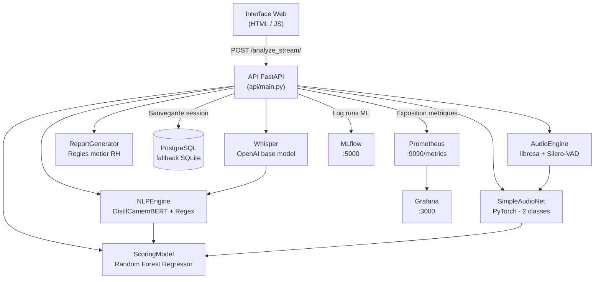

# PRO8605 — Plateforme d'Analyse Soft Skills & Simulateur d'Entretien

[](https://github.com/jaderld/pro8605/actions/workflows/ci-cd.yml)

> Projet de Fin d'Études — Application B2B d'analyse comportementale audio/texte en temps réel, avec scoring IA, monitoring MLOps et pipeline complet de Machine Learning.

---

## Table des matières

1. [Vue d'ensemble](#1-vue-densemble)
2. [Guide fonctionnel — Ce que fait le projet](#2-guide-fonctionnel--ce-que-fait-le-projet)
   - 2.1 [Parcours utilisateur](#21-parcours-utilisateur)
   - 2.2 [Le simulateur d'entretien](#22-le-simulateur-dentretien)
   - 2.3 [Ce qui est analysé dans votre prise de parole](#23-ce-qui-est-analysé-dans-votre-prise-de-parole)
   - 2.4 [Le score global : comment il est calculé](#24-le-score-global--comment-il-est-calculé)
   - 2.5 [Le rapport d'analyse détaillé](#25-le-rapport-danalyse-détaillé)
   - 2.6 [Analyse de pertinence par intelligence artificielle](#26-analyse-de-pertinence-par-intelligence-artificielle)
   - 2.7 [Exemples de résultats concrets](#27-exemples-de-résultats-concrets)
3. [Architecture](#3-architecture)
4. [Pipeline d'analyse temps réel](#4-pipeline-danalyse-temps-réel)
5. [Modèles — Fonctionnement & Entraînement](#5-modèles--fonctionnement--entraînement)
   - 5.1 [AudioEngine — Extraction de features](#51-audioengine--extraction-de-features)
   - 5.2 [Modèle DL — SimpleAudioNet (PyTorch)](#52-modèle-dl--simpleaudionet-pytorch)
   - 5.3 [Transcription — Whisper (OpenAI)](#53-transcription--whisper-openai)
   - 5.4 [NLPEngine — DistilCamemBERT](#54-nlpengine--distilcamembert)
   - 5.5 [Modèle ML — Random Forest Regressor](#55-modèle-ml--random-forest-regressor)
   - 5.6 [Rapport structuré — Générateur basé sur règles](#56-rapport-structuré--générateur-basé-sur-règles)
   - 5.7 [Endpoints d'entraînement à la demande](#57-endpoints-dentraînement-à-la-demande)
6. [Métriques évaluées](#6-métriques-évaluées)
7. [MLOps — Tracking & Monitoring](#7-mlops--tracking--monitoring)
8. [Données d'entraînement](#8-données-dentraînement)
9. [Installation & Lancement](#9-installation--lancement)
10. [CI/CD — Intégration & Déploiement Continu](#10-cicd--intégration--déploiement-continu)
11. [Tests unitaires](#11-tests-unitaires)
12. [Structure du projet](#12-structure-du-projet)
13. [Limites & Roadmap](#13-limites--roadmap)

---

## 1. Vue d'ensemble

Ce projet est une plateforme web full-stack permettant à un candidat (ou formateur RH) d'enregistrer une prise de parole depuis le navigateur et d'obtenir en retour une **analyse automatique complète** de ses soft skills :

| Dimension | Ce qui est mesuré |
|---|---|
| **Voix physique** | Volume RMS, débit (BPM), ratio de silences |
| **Émotion** | Classification binaire Calme / Stressé (PyTorch) |
| **Discours** | Transcription automatique (Whisper), sentiment (DistilCamemBERT), tics de langage |
| **Score global** | Note /100 calculée par Random Forest + pénalités |
| **Rapport détaillé** | Texte structuré généré par règles métier RH (5 sections) |

---

## 2. Guide fonctionnel — Ce que fait le projet

Ce projet est un **simulateur d'entretien professionnel** conçu pour aider les candidats à améliorer leur prise de parole avant un vrai entretien d'embauche. L'idée est simple : vous parlez dans votre micro comme si vous répondiez à une question d'entretien, et l'application vous donne un retour complet sur votre performance — exactement comme un coach RH le ferait, mais de manière instantanée et accessible depuis un navigateur web.

Le projet s'adresse aussi bien aux **candidats** qui veulent s'entraîner seuls qu'aux **formateurs et cabinets RH** qui souhaitent proposer un outil d'évaluation objectif et reproductible à grande échelle.

### 2.1 Parcours utilisateur

Voici ce qui se passe concrètement quand vous utilisez l'application :

1. **Vous ouvrez l'interface web** dans votre navigateur (actuellement en local ; http://localhost:8000). L'interface est conçue pour mettre l'utilisateur dans des conditions proches d'un entretien réel.

2. **Vous renseignez votre profil** : votre domaine de compétences (ex. « développement web »), le type de poste visé (ex. « développeur full-stack junior ») et éventuellement les points que vous souhaitez travailler (ex. « gestion du stress, structurer mes réponses »).

3. **L'IA génère une question d'entretien personnalisée** à partir de votre profil. Un modèle de langage (LLM) formule une question sur mesure, adaptée à votre domaine et à votre poste. Par exemple, pour un profil « marketing digital / chef de projet », l'IA pourrait demander : *« Racontez-moi une situation dans laquelle vous avez dû gérer un conflit avec un prestataire externe tout en respectant un deadline serré. »*

4. **Vous cliquez sur le bouton d'enregistrement** et vous répondez oralement à la question, comme vous le feriez en vrai entretien. Vous parlez dans votre micro pendant 30 secondes à quelques minutes.

5. **Vous arrêtez l'enregistrement.** L'analyse démarre automatiquement et les résultats apparaissent en temps réel, étape par étape, directement dans l'interface.

6. **Vous recevez votre score, votre rapport détaillé et des conseils personnalisés.** Tout est affiché dans l'interface, et vous pouvez copier ou télécharger le rapport complet.

### 2.2 Le simulateur d'entretien

Le simulateur est le cœur de l'expérience utilisateur. Il ne se contente pas d'analyser un fichier audio — il **simule un vrai entretien** en trois temps :

**Étape 1 — Génération de la question**
Grâce à un LLM local (Llama 3.2 via Ollama), l'application génère une question d'entretien réaliste et pertinente. Le modèle joue le rôle d'un recruteur RH senior et adapte la question au profil du candidat. Cela permet de :
- S'entraîner sur des questions variées à chaque session
- Cibler des compétences comportementales spécifiques (leadership, gestion de conflit, travail en équipe…)
- Reproduire la surprise d'une vraie question d'entretien (on ne connaît pas la question à l'avance)

**Étape 2 — Enregistrement de la réponse**
L'utilisateur répond oralement via son micro. L'enregistrement est capturé directement dans le navigateur (MediaRecorder API) — aucun logiciel externe n'est nécessaire.

**Étape 3 — Analyse complète et rapport**
Dès la fin de l'enregistrement, l'application lance un pipeline complet d'analyse qui évalue la voix, le discours, l'émotion, et calcule un score global. Le rapport s'affiche en temps réel (ligne par ligne, en streaming) pour une expérience fluide.

### 2.3 Ce qui est analysé dans votre prise de parole

L'application évalue **7 dimensions** de votre prise de parole. Voici ce que chacune mesure et pourquoi c'est important :

| Dimension | Ce qui est évalué | Pourquoi c'est important en entretien |
|---|---|---|
| **Volume de la voix** | Intensité sonore moyenne de votre discours | Un volume trop faible donne une impression de manque de confiance ; trop fort, d'agressivité |
| **Débit de parole** | Nombre de mots prononcés par minute | Un débit trop rapide trahit le stress et rend le discours difficile à suivre ; trop lent, il ennuie |
| **Gestion des silences** | Proportion du temps de parole vs le temps total | Des pauses bien placées structurent le discours ; trop de silences révèlent des hésitations |
| **Émotion détectée** | Classification « Calme » ou « Stressé » à partir des caractéristiques acoustiques | Le contrôle émotionnel est un critère clé : un candidat calme inspire davantage confiance |
| **Sentiment du discours** | Tonalité globale (positive, neutre ou négative) du contenu textuel | Un discours positif et engagé fait meilleure impression qu'un discours négatif ou défaitiste |
| **Tics de langage** | Comptage des mots parasites (« euh », « du coup », « voilà », « en fait », « bah »…) | Les tics de langage fragmentent le discours et pénalisent fortement la perception de professionnalisme |
| **Richesse du discours** | Nombre de mots, développement des réponses | Une réponse trop courte est insuffisante ; une réponse développée avec des exemples concrets est valorisée |

### 2.4 Le score global : comment il est calculé

Le score final est une **note sur 100** qui résume la qualité globale de votre prise de parole. Il est calculé en deux temps :

**1. Score de base (Random Forest)**
Un modèle de Machine Learning (Random Forest) combine les 6 métriques principales (volume, débit, pauses, sentiment, taux de tics, stress) pour prédire un score brut. Ce modèle a été entraîné sur 2 000 sessions simulées avec des profils variés. Il apprend les relations non linéaires entre les métriques — par exemple, un débit rapide n'est pas toujours mauvais, mais combiné à un taux élevé de tics, il devient pénalisant.

**2. Gardes-fous et pénalités**
Le score brut est ensuite ajusté par des règles métier inspirées des grilles d'évaluation RH :
- **Tics de langage excessifs** : si plus de 25% de vos mots sont des tics, le score est plafonné à 20/100, quel que soit le score du modèle. C'est le critère le plus pénalisant, car un recruteur relève immédiatement les « euh » et « du coup » répétés.
- **Débit trop rapide** : au-delà de 220 mots/minute, le score est plafonné à 55/100.
- Des seuils intermédiaires s'appliquent pour les cas modérés.

**Interprétation du score :**

| Score | Interprétation |
|---|---|
| 76 – 100 | **Excellent** — performance convaincante, prêt pour un entretien réel |
| 46 – 75 | **Moyen** — des qualités visibles mais des axes d'amélioration à travailler |
| 21 – 45 | **À améliorer** — plusieurs dimensions sont en dessous des attentes |
| 0 – 20 | **Insuffisant** — préparation approfondie nécessaire avant un entretien réel |

### 2.5 Le rapport d'analyse détaillé

Au-delà du score, l'application génère un **rapport complet en 6 sections**, rédigé dans un style de feedback professionnel RH :

**Section 1 — Résumé global**
Un paragraphe de synthèse qui donne le ton : performance globale, émotion perçue, sentiment dominant. Ce résumé correspond à ce qu'un recruteur penserait en 30 secondes.

**Section 2 — Analyse détaillée des scores**
Chaque métrique est analysée individuellement avec un verdict (excellent, correct, insuffisant…) et une explication concrète. Par exemple : *« Débit vocal : 142 mots/min (Modéré) → Idéal. Le rythme favorise la compréhension et maintient l'attention de l'interlocuteur. »*

**Section 3 — Analyse de la transcription**
La transcription complète de votre discours est affichée, suivie d'une analyse de la longueur (trop courte ? bien développée ?), de la richesse lexicale et du détail précis de chaque tic de langage détecté avec son nombre d'occurrences.

**Section 4 — Feedback personnalisé**
Deux listes concrètes :
- **Points forts** : ce que vous faites bien (ex. « Volume vocal adapté — la voix est bien projetée et agréable à entendre »)
- **Axes d'amélioration** : ce qu'il faut travailler en priorité (ex. « Éliminer les tics de langage — 7 occurrences de "euh" et "du coup" détectées »)

**Section 5 — Conseils pratiques**
Des recommandations actionnables pour progresser : méthode STAR pour structurer les réponses, exercices de respiration pour gérer le stress, techniques pour réduire les tics de langage, etc.

**Section 6 — Conclusion IA (optionnelle)**
Si le LLM local (Ollama) est disponible, une conclusion personnalisée est générée par intelligence artificielle. Elle synthétise les résultats en 4 à 6 phrases dans un ton de coach RH bienveillant mais objectif. Cette section est affichée en streaming (token par token) pour une expérience instantanée.

### 2.6 Analyse de pertinence par intelligence artificielle

Lorsque le simulateur est utilisé avec une question générée (mode entretien complet), une analyse supplémentaire est réalisée :

L'IA compare **la question posée** avec **votre réponse transcrite** et évalue :
- Le candidat a-t-il bien compris la question ?
- La réponse est-elle structurée et argumentée ?
- Les exemples donnés sont-ils pertinents pour le poste visé ?
- Quels conseils concrets pour améliorer cette réponse ?

Cette analyse est particulièrement utile pour travailler le **fond** de la réponse (pas seulement la forme vocale). Elle est affichée en streaming, juste après le rapport, pour un feedback complet en une seule session.

### 2.7 Exemples de résultats concrets

Voici à quoi ressemblent les résultats selon différents profils de candidats :

**Candidat à l'aise (score ~80/100)**
> Score : 82/100 — Excellent. Volume bien projeté, débit idéal (135 mots/min), aucun tic de langage, émotion calme. Rapport : « Le candidat démontre une aisance à l'oral et une très bonne maîtrise de l'expression en entretien. Son discours est fluide, structuré et convaincant. »

**Candidat stressé avec tics (score ~35/100)**
> Score : 35/100 — À améliorer. Débit rapide (195 mots/min), 8 tics de langage détectés ("euh" x4, "du coup" x3, "voilà" x1), émotion stressée, pauses rares (8%). Rapport : « L'entretien met en évidence plusieurs difficultés nécessitant un travail préparatoire sérieux, notamment sur la fluidité et la maîtrise du stress. »

**Candidat réservé (score ~55/100)**
> Score : 55/100 — Moyen. Volume faible, débit lent (95 mots/min), peu de tics mais réponse courte (22 mots). Rapport : « L'entretien révèle des qualités intéressantes mais les réponses pourraient être davantage développées avec des exemples concrets. »

L'objectif est que le candidat puisse **s'entraîner plusieurs fois**, comparer ses scores et progresser session après session sur les dimensions identifiées comme faibles.

---

## 3. Architecture



### Services Docker

| Service | Port | Rôle |
|---|---|---|
| `api` | 8000 | Backend FastAPI + Frontend statique |
| `mlflow` | 5000 | Tracking des expériences ML |
| `postgres` | 5432 | Base de données sessions |
| `prometheus` | 9090 | Collecte des métriques temps réel |
| `grafana` | 3000 | Dashboard de visualisation |
| `tensorboard` | 6006 | Visualisation des courbes d'entraînement (DL & ML) |
| `ollama` | 11434 | LLM local (llama3.2:3b) — conclusions & questions |

---

## 4. Pipeline d'analyse temps réel

```
① Réception du fichier audio (WAV via MediaRecorder)
② AudioEngine.process_signal()
   → librosa : RMS volume, tempo (beat_track), ZCR, spectral_centroid
   → Silero-VAD : détection des segments de parole → pause_ratio
   → dl_input_vector = [rms, zcr, spec_centroid/1000, tempo/200, pause_ratio]
③ InterviewModel.transcribe_audio()     [Whisper base, fr]
④ InterviewModel.predict_emotion()      [SimpleAudioNet]
⑤ NLPEngine.analyze_text()              [DistilCamemBERT + Regex]
⑥ ScoringModel.predict_score()          [Random Forest]
⑦ Calcul du score final avec pénalités  [tics x10 + sentiment_penalty]
⑧ Génération rapport structuré          [règles métier RH, 5 sections]
⑨ Réponse JSON → affichage UI
```

---

## 5. Modèles — Fonctionnement & Entraînement

### 5.1 AudioEngine

Features extraites via `librosa` et `Silero-VAD` :

| Feature | Méthode | Normalisation |
|---|---|---|
| `volume` | RMS moyen | brut |
| `tempo` | beat_track | /200.0 pour DL |
| `zcr` | zero_crossing_rate | brut |
| `spectral_centroid` | spectral_centroid | /1000.0 pour DL |
| `pause_ratio` | Silero-VAD | [0, 1] |

Vecteur d'entrée DL :
```python
dl_input_vector = [rms, zcr, spectral_centroid/1000.0, tempo/200.0, pause_ratio]
```

### 5.2 Modèle DL — SimpleAudioNet (PyTorch)

Architecture :
```
Input (5) → Linear(5→64) → ReLU → Dropout(0.2)
          → Linear(64→32) → ReLU
          → Linear(32→2)  → [Softmax à l'inférence]
```

Hyperparamètres : `epochs=50`, `batch_size=16`, `Adam(lr=0.001)`, `CrossEntropyLoss`, `Dropout=0.2`

Évaluation (loggée dans MLflow) :
- `train_loss`, `test_accuracy`, `test_f1` par epoch (courbes de convergence)
- En fin d'entraînement : `precision`, `recall`, matrice de confusion (JSON), rapport de classification (texte)

### 5.3 Transcription — Whisper

Whisper `base` (74M params), `language="fr"`, avec prompt d'amorçage ciblant les hésitations françaises :
```python
initial_prompt = "C'est un entretien d'embauche. Le candidat hésite souvent, il dit euh, bah, voilà, du coup."
```

### 5.4 NLPEngine — DistilCamemBERT

- **Modèle** : `cmarkea/distilcamembert-base-sentiment` — distillation de CamemBERT, nativement français
- **Tâche** : classification 5 classes (1 à 5 étoiles) → score continu [-1, +1] par moyenne pondérée

```
score = sum( (i-3)/2 * p_i  for i in [1..5] )
```

- **Tics de langage** : détection Regex `\b mot \b` sur liste configurable (`config/settings.yaml`)
- **Truncation** : 2048 caractères (≈ 512 tokens, limite du modèle)

### 5.5 Modèle ML — Random Forest Regressor

Features : `['volume', 'tempo', 'pause_ratio', 'sentiment', 'filler_rate', 'stress_level']`

Hyperparamètres : `n_estimators=100`, `max_depth=10`, `test_size=20%`, `random_state=42`

Évaluation (loggée dans MLflow) :
- Courbe de convergence : MAE + R² aux checkpoints `[1, 5, 10, 25, 50, 75, 100]` arbres
- **K-Fold Cross-Validation (5 folds)** sur l'ensemble complet : `cv_mae_mean ± std`, `cv_r2_mean ± std`
- Importance des 6 features
- Artefact JSON d'évaluation complet (`evaluation_summary.json`)

### 5.6 Rapport structuré — Générateur basé sur règles

`src/processors/report_generator.py` — 5 sections déterministes :

| Section | Contenu |
|---|---|
| 1. Résumé global | Performance globale selon seuils de score |
| 2. Analyse des scores | Volume, tempo, pauses, tics — comparaison aux seuils RH |
| 3. Analyse de la transcription | Nombre de mots, richesse du discours, détail des tics |
| 4. Feedback personnalisé | Points forts + axes d'amélioration ciblés |
| 5. Conseils pratiques | Recommandations concrètes (méthode STAR, respiration, débit...) |

### 5.7 Endpoints d'entraînement

| Route | Méthode | Effet |
|---|---|---|
| `/train/dl` | POST | Entraîne SimpleAudioNet, sauvegarde `emotion_net.pth`, log MLflow |
| `/train/ml` | POST | Entraîne Random Forest, sauvegarde `scoring_rf.joblib`, log MLflow |

---

## 6. Métriques évaluées

| Modèle | Métrique | Valeur typique |
|---|---|---|
| SimpleAudioNet | Accuracy | ~70–80% |
| SimpleAudioNet | F1-score (weighted) | ~0.70–0.78 |
| SimpleAudioNet | Precision / Recall | loggés par epoch |
| Random Forest | MAE (holdout) | ~6–10 pts |
| Random Forest | R2 (holdout) | ~0.70–0.85 |
| Random Forest | MAE (5-fold CV) | stabilisé ± std |

---

## 7. MLOps — Tracking & Monitoring

### MLflow — Expériences d'entraînement

- URL : http://localhost:5000
- Expériences : `Audionet_DL`, `Final_Scoring_ML`
- Artefacts loggés : modèles `.pth`/`.joblib`, rapports de classification, matrices de confusion, résumés d'évaluation JSON

### Prometheus — Métriques d'inférence temps réel

- URL : http://localhost:9090
- Scrape toutes les 10s depuis `api:8000/metrics`
- Métriques par étape du pipeline :

| Etape | Métriques |
|---|---|
| Audio | `audio_duration_seconds`, `audio_pause_ratio`, `audio_tempo_bpm`, `audio_volume_rms` |
| Transcription | `dl_transcription_time_seconds`, `transcription_word_count` |
| NLP | `nlp_filler_words_total`, `nlp_filler_words_per_analysis`, `nlp_sentiment_score` |
| Emotion | `audio_stress_level`, `model_inference_time_seconds`, `model_prediction_confidence` |
| Scoring | `interview_final_score`, `interview_base_score`, `interview_score_penalty`, `interview_score_interpretation_total` |
| API | `api_requests_total` |

### Grafana — Dashboard

- URL : http://localhost:3000
- 18 panneaux organisés en 5 sections (pipeline stages)
- Auto-provisionné au démarrage

---

## 8. Données d'entraînement

`storage/fake_sessions.csv` — 2000 sessions synthétiques, 12% de bruit de labels

Distribution par classe :
- `label=1` (Stressé) : `volume~N(0.05, 0.03)`, `bpm~N(130, 25)`, `pause_ratio~N(0.35, 0.15)`
- `label=0` (Calme)   : `volume~N(0.07, 0.04)`, `bpm~N(110, 20)`, `pause_ratio~N(0.18, 0.10)`

Formule du score cible (pondération multi-critères) :
```python
raw_score = (
    _score_filler_rate(filler_rate) * 0.35   # tics de langage (pénalité quadratique)
    + _score_tempo(wpm)             * 0.18   # débit vocal
    + ((sentiment + 1) * 50)        * 0.14   # positivité (-1→0, +1→100)
    + _score_volume(volume)         * 0.10   # projection
    + _score_pauses(pause_ratio)    * 0.10   # structure
    + (30 if stressé else 80)       * 0.08   # contrôle émotionnel
    + _score_richness(word_count)   * 0.05   # richesse lexicale
)
target_score = clamp(0, 100, round(raw_score + bruit_gaussien(±5)))
```

---

## 9. Installation & Lancement

### Docker (recommandé)

```bash
docker-compose up --build -d
```

Les modèles HuggingFace (DistilCamemBERT, ~260 Mo) et Whisper (~150 Mo) sont téléchargés au build
et mis en cache dans des volumes Docker persistants (`hf_cache`, `whisper_cache`, `torch_cache`).

### Local (développement)

```bash
python -m venv venv
venv\Scripts\activate          # Windows
pip install -r requirements.txt

# Générer les données d'entraînement
python scripts/simulate_data.py

# Lancer l'API
uvicorn api.main:app --host 0.0.0.0 --port 8000 --reload
```

### Entraînement des modèles

```bash
# Via API (avec données fake_sessions.csv)
curl -X POST http://localhost:8000/train/dl
curl -X POST http://localhost:8000/train/ml

# Via Makefile
make train-dl
make train-ml
```

---

## 10. CI/CD — Intégration & Déploiement Continu

Le projet utilise **GitHub Actions** pour automatiser la vérification, les tests et le déploiement à chaque modification du code.

### Pipeline

```
push / PR sur main
  │
  ├── 🔍 Lint (flake8)
  │       │
  │       └── 🧪 Tests unitaires + couverture
  │               │
  │               ├── 📦 Rapport de couverture (artifact)
  │               ├── 🔒 Audit sécurité dépendances (pip-audit)
  │               │
  │               └── 🐳 Docker Build & Push (GHCR)
  │                       (uniquement sur push main / tag)
```

### Jobs

| Job | Déclencheur | Description |
|---|---|---|
| **Lint** | push + PR | Vérifie la qualité du code avec flake8 (120 car/ligne, règles projet) |
| **Test** | après Lint | Exécute les 13 tests unitaires avec `coverage`, génère le rapport XML |
| **Security** | après Test | Scanne les dépendances Python avec `pip-audit` (vulnérabilités connues) |
| **Docker** | push main/tag | Build l'image Docker multi-stage, push vers `ghcr.io/jaderld/pro8605` |

### Image Docker

L'image est automatiquement publiée sur **GitHub Container Registry** :

```bash
# Dernière version
docker pull ghcr.io/jaderld/pro8605:latest

# Version spécifique (commit SHA)
docker pull ghcr.io/jaderld/pro8605:<sha>

# Version taggée (ex: v1.0.0)
docker pull ghcr.io/jaderld/pro8605:1.0.0
```

### Tags Docker

| Tag | Quand |
|---|---|
| `latest` | Chaque push sur `main` |
| `<sha>` | Chaque push (identifiant unique du commit) |
| `<version>` | Quand un tag `v*` est poussé (ex: `v1.0.0` → `1.0.0`) |

### Optimisations

- **Cache pip** : les dépendances Python sont mises en cache entre les runs
- **Cache Docker (GHA)** : les layers Docker sont cachés via GitHub Actions cache
- **BuildX** : build multi-plateforme avec gestion avancée du cache
- **Modèles offline** : `TRANSFORMERS_OFFLINE=1` et `HF_HUB_OFFLINE=1` évitent les téléchargements en CI

---

## 11. Tests unitaires

```bash
python -m unittest discover -s tests/unit

# Tests individuels
python -m unittest tests.unit.test_ml_model
python -m unittest tests.unit.test_dl_model
python -m unittest tests.unit.test_data_pipeline

# Test NLP + ML (sans audio, sans Docker)
make test-nlp
```

---

## 12. Structure du projet

```
pro8605/
├── .env.example                    (variables d'environnement — à copier en .env)
├── api/
│   ├── Dockerfile
│   ├── main.py
│   └── static/                 (index.html, script.js, style.css)
├── config/
│   └── settings.yaml           (sample_rate, thresholds, fillers)
├── database/
│   └── db_manager.py           (SQLite / PostgreSQL dual-backend)
├── docker-compose.yml
├── infra/
│   ├── grafana/                (dashboard JSON, provisioning)
│   └── prometheus/             (prometheus.yaml)
├── Makefile
├── requirements.txt
├── scripts/
│   ├── init_postgres.py
│   ├── simulate_data.py
│   └── test_nlp_bypass.py
├── src/
│   ├── data_pipeline.py
│   ├── models/
│   │   ├── dl_model.py         (Whisper + SimpleAudioNet)
│   │   └── ml_model.py         (Random Forest Regressor)
│   ├── monitoring/
│   │   ├── metrics.py          (Prometheus — 18 metriques)
│   │   └── mlflow/
│   │       ├── setup.py        (init_mlflow)
│   │       └── utils.py        (log_params, log_step_metrics, ...)
│   └── processors/
│       ├── audio_engine.py     (librosa + Silero-VAD)
│       ├── nlp_engine.py       (DistilCamemBERT + Regex)
│       ├── ollama_client.py    (LLM local — conclusion, questions, pertinence)
│       └── report_generator.py (rapport structuré 5 sections)
├── storage/
│   ├── fake_sessions.csv
│   └── models/
│       ├── emotion_net.pth
│       └── scoring_rf.joblib
└── tests/unit/
    ├── test_data_pipeline.py
    ├── test_dl_model.py
    └── test_ml_model.py
```

---

## 13. Limites & Roadmap

| Aspect | Limite actuelle |
|---|---|
| Données | Dataset synthétique — distribution gaussienne, biais possible en conditions réelles |
| SimpleAudioNet | MLP sur 5 features tabulaires — pas un modèle audio profond (pas de spectrogramme) |
| Whisper | Lent sur CPU (~10–30s/min audio) — utiliser large-v3 pour plus de précision |
| DistilCamemBERT | Entrainé sur avis produits (1–5 etoiles), pas sur discours d'entretien |
| Auth | Aucune authentification — usage académique uniquement |
| Cross-validation DL | Absente pour le modèle PyTorch (présente uniquement pour RF) |
| Secrets | Mots de passe PostgreSQL en clair dans `settings.yaml` et `docker-compose.yml` — usage académique uniquement |

Roadmap :
- JWT auth + rôles (candidat / recruteur)
- Modèle audio profond sur spectrogrammes (CNN sur MFCC ou wav2vec2)
- Fine-tuning CamemBERT sur corpus d'entretiens
- Streaming audio long (> 5 minutes)
- Alerting Grafana (seuils de score)
- API LLM externe (GPT-4o) pour rapport enrichi
